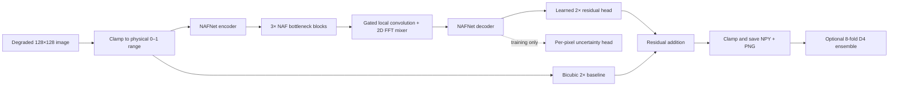
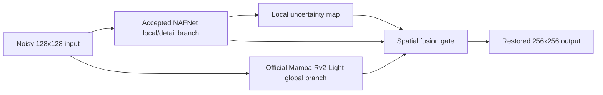

# SemiCon Restore: Research NAFNet-SR for Semiconductor Inspection

[](https://colab.research.google.com/github/kmbeddedd/semicon_2026/blob/Kunal/train_colab.ipynb)
[](https://www.python.org/)
[](https://pytorch.org/)
[](#robustness-and-verification)

An end-to-end deep-learning pipeline for the **KLA Challenge PS01**: restore noisy, undersampled semiconductor inspection images while upscaling them from `128×128` to `256×256`.

The verified solution combines a lightweight NAFNet backbone, a physical bicubic residual path, a learned local/FFT feature mixer, uncertainty-aware training, and optional 8-fold test-time augmentation. An isolated experimental track adds identity-safe NAFNet/MambaIRv2 fusion, ADD/ADD+ augmentation, and an MSE PSNR-polish schedule without replacing the accepted checkpoint. It includes training, evaluation, data characterization, cloud notebooks, strict checkpoint loading, and submission-ready NPY/PNG generation.

## 60-second judge overview

| Question | Answer |
|---|---|
| **What is the problem?** | Joint denoising and 2× super-resolution of low-dose semiconductor inspection images. |
| **What is the input/output?** | One grayscale `128×128` degraded image → one restored `256×256` image in physical `[0,1]` intensity range. |
| **What was built?** | A 10.23M-parameter Research NAFNet-SR, complete training/evaluation pipeline, Google Colab and Kaggle workflows, and a verified checkpoint. |
| **What is novel here?** | Identity-safe transfer from a proven residual model into a gated **2D local/FFT bottleneck mixer**, plus a beta-NLL uncertainty head used as auxiliary supervision. |
| **Best verified result** | **28.83964 dB PSNR** with 8-fold TTA across all 320 validation pairs. |
| **Improvement over the prior model** | **+0.03406 dB PSNR with TTA**, improving 286/320 paired validation images. |
| **Speed** | 14.05 ms/image without TTA (71.2 images/s) or 145.55 ms/image with maximum-accuracy TTA on an RTX 2050. |
| **Reproducibility** | Seeded training, self-describing checkpoints, strict state loading, atomic saves, 19 automated tests, and full-dataset evaluation. |
| **Next experiment** | Official MambaIRv2-Light global branch + NAFNet local branch, spatial uncertainty-guided fusion, ADD+, then pure-MSE polish. This is implemented but not yet claimed as an improvement. |

## Why this solution stands out

1. **Metrology-safe residual prediction** — the network predicts only the correction to bicubic upsampling, preserving the low-frequency physical structure instead of recreating the entire image.
2. **Spatial and frequency reasoning** — local depthwise convolution captures edges and line patterns while a 2D FFT path supplies global periodic context at the bottleneck.
3. **Uncertainty-aware optimization** — a per-pixel variance head and beta-NLL auxiliary loss emphasize difficult regions without using stochastic inference.
4. **Evidence before claims** — every headline number is reproduced on all 320 held-out pairs; the README also reports metric regressions and clean-input limitations.
5. **Practical delivery** — FP16, TorchScript, batched inference, D4 TTA, Google Drive resume support, dual-GPU training, and both `.npy` and preview `.png` outputs are included.

### Technology stack

| Layer | Technology |
|---|---|
| Modeling | Python, PyTorch, NAFNet, PixelShuffle, 2D FFT |
| Image and signal analysis | NumPy, OpenCV, PyWavelets, SciPy, scikit-image |
| Quality measurement | PSNR, SSIM, LPIPS, Wavelet-MAD, clean-input audit |
| Acceleration | CUDA, AMP FP16, channels-last tensors, TorchScript, batched D4 TTA |
| Experiment delivery | Google Colab, Google Drive resume, Kaggle dual-GPU, Git LFS |

## Verified results

All rows use the same 320-image validation split, the same `[0,1]` preprocessing, and per-image metrics averaged over the dataset. GPU timing measures synchronized model compute on an NVIDIA RTX 2050; it excludes file I/O and metric calculation.

| Model / inference mode | PSNR ↑ | SSIM ↑ | LPIPS ↓ | Latency | Throughput |
|---|---:|---:|---:|---:|---:|
| Preprocessing-matched bicubic | 22.79 dB | 0.5330 | 0.4400 | — | — |
| Previous NAFNet-SR, FP16 + JIT | 28.70997 dB | **0.7831** | **0.2436** | 14.22 ms | 70.3 img/s |
| **Research NAFNet-SR, FP16 + JIT** | **28.73138 dB** | 0.7826 | 0.2536 | **14.05 ms** | **71.2 img/s** |
| **Research NAFNet-SR + 8-fold TTA** | **28.83964 dB** | **0.7851** | 0.2566 | 145.55 ms | 6.9 img/s |

### Interpreting the result honestly

- The accepted research checkpoint is **epoch 8** of a 20-epoch Colab fine-tune. Epoch 20 reached 28.72345 dB, so it is retained only for resuming; it is not used for inference.
- Against the previous model, no-TTA PSNR improved by **+0.02141 dB** with a paired bootstrap 95% interval of `[+0.01677, +0.02618]` dB.
- With TTA, PSNR improved by **+0.03406 dB**, with a paired bootstrap 95% interval of `[+0.03060, +0.03763]` dB and wins on **286 of 320** images.
- This is a targeted **PSNR improvement**, not a universal perceptual win: SSIM changes slightly and LPIPS is worse than the previous checkpoint.
- The current checkpoint scores 29.03 dB on the 50-image clean-input audit, versus 30.80 dB for bicubic. A deployment receiving already-clean inputs should add a calibrated bypass/gating policy.

The model gains **+6.05 dB** over bicubic with TTA. A Wavelet-MAD analysis of the validation targets gives a 38.72 dB high-frequency noise estimate; this is descriptive and is **not** presented as a formal performance ceiling.

## System design



### 1. Research NAFNet-SR backbone

- Single-channel input/output with width 64.
- Three encoder and three decoder stages, each containing two NAFBlocks.
- Three additional NAFBlocks at the 512-channel bottleneck.
- PixelShuffle reconstruction for 2× super-resolution.
- Global bicubic residual skip for stable photometric reconstruction.
- **10,233,986 parameters** total; the uncertainty branch is skipped during normal inference.
- Canonical checkpoint size: approximately **41.05 MB**.

NAFBlocks use activation-free gating, depthwise convolution, simple channel attention, LayerNorm2d, and learnable residual scales. The final reconstruction layer was zero-initialized when the original backbone was trained, making the initial prediction exactly bicubic.

### 2. Gated local/FFT mixer

The research extension processes bottleneck features through two complementary paths:

- A depthwise `3×3` convolution captures local boundaries and repeated line-space patterns.
- An FP32 `rFFT2 → grouped 1×1 mixing → irFFT2` path captures global periodic structure.
- A learned channel gate blends both paths.
- The output projection was initialized to zero during transfer, so adding the extension initially preserved the previous model exactly.

The FFT path remains FP32 even under AMP/FP16 evaluation to avoid complex-frequency numerical issues.

### 3. Uncertainty-aware auxiliary head

During training, the decoder also predicts raw per-pixel variance. Softplus converts it into a positive variance and beta-NLL supervises difficult or ambiguous regions. Variance weighting is detached to reduce the incentive to inflate uncertainty. Normal inference returns only the deterministic restored image, so the uncertainty head adds no output-side complexity.

### 4. Experimental global/local fusion

The new research path in `train_fusion.py` combines two complementary restorers:



- The local branch begins from the accepted semiconductor checkpoint.
- The global branch is the authors' official MambaIRv2-Light x2 architecture and pretrained state; its source is not copied into this repository.
- A small spatial gate sees the local prediction, global prediction, their absolute disagreement, and the local uncertainty cue.
- The gate's last projection is exactly zero-initialized. At step zero, the fused output is bit-identical to NAFNet, regardless of the MambaIRv2 prediction.
- Fusion checkpoints record `model_type`, both architecture configurations, all branch weights, and freeze policy. `eval.py` reconstructs them strictly when `--mambair_repo` is supplied.

This is an experiment, not a new headline result. `weights/best_model.pt` remains the accepted default until a fusion checkpoint exceeds its full-validation PSNR.

### 5. ADD/ADD+ and PSNR polishing

The dataset now supports `none`, `d4`, `classic`, `add`, and `add_plus` augmentation modes. ADD/ADD+ perform saliency-region mixing at corresponding coordinates in both LR and HR images, preserving the supervised 2x geometry. Precomputed calibrated attribution masks can be passed through `--saliency_dir`. If they are absent, the loader uses a clearly labelled coarse 2x2 proxy based on target gradients and paired degradation residuals; it is not presented as the paper's CAM.

For metric alignment, `MetrologyLoss` now includes exact MSE. `--psnr_polish_epochs N` linearly removes Charbonnier, edge, FFT, SSIM, and beta-NLL terms over the final `N` epochs and finishes on pure MSE, the objective directly corresponding to PSNR. The Colab fusion workflow uses ADD+ first and switches to D4-only data for the final polish stage.

### 6. Composite metrology loss

The accepted training objective is:

$$
\mathcal{L} =
1.00\mathcal{L}_{Charbonnier}
+0.05\mathcal{L}_{Sobel}
+0.05\mathcal{L}_{FFT}
+0.20\mathcal{L}_{MS\text{-}SSIM}
+0.02\mathcal{L}_{\beta\text{-}NLL}
$$

| Component | Purpose |
|---|---|
| Charbonnier | Robust pixel-level restoration and outlier tolerance. |
| Sobel edge | Preserves line boundaries and critical-dimension edges. |
| Orthonormal FFT | Penalizes frequency-domain mismatch without overwhelming spatial losses. |
| Two-scale SSIM | Preserves structure at local and broader pattern scales. |
| Beta-NLL | Adds calibrated heteroscedastic supervision through the uncertainty head. |

All loss calculations are forced to FP32 under AMP. Training predictions remain unclamped to preserve out-of-range gradients; evaluation results are clamped to `[0,1]`.

## Dataset and empirical characterization

| Split | Degraded input | Ground truth | Pairs |
|---|---|---|---:|
| Training | `data/train/NoisyLR` | `data/train/GT` | 2,880 |
| Validation | `data/val/NoisyLR` | `data/val/GT` | 320 |
| Hidden test | `data/test/NoisyLR` | Not provided | 400 |

The canonical Git LFS archives are `train.zip` and `Test_NoisyLR.zip`. The split is deterministic with seed 42, filename-paired, and non-overlapping.

### What the data analysis established

- Inputs and targets are already physically scaled; preprocessing therefore clips to `[0,1]` instead of applying destructive per-image percentile rescaling.
- Bicubic downsampling gave the lowest tested paired residual MSE (`0.006392`) compared with area averaging (`0.006438`), nearest neighbor (`0.008428`), and strided sampling (`0.008428`).
- The tested Gaussian blur sweep was best at additional blur `σ=0.0`; no artificial pre-blur is used.
- Validation target Wavelet-MAD estimated mean `σ=0.016798`, equivalent to 38.72 dB. Real image structure can enter the high-frequency bands, so this remains a heuristic.
- A local regression explored $Var(y\mid\mu)=a\mu^2+b$ with $a=3.346\times10^{-2}$ and $b=1.781\times10^{-2}$. This can conflate texture with sensor noise and is not treated as a calibrated detector model.

Training augmentation applies paired rotations/flips, occasional CutBlur, and occasional Gaussian noise jitter. Pair shapes, filenames, finite values, and 2× scale consistency are validated before use.

Reproduce the signal characterization and clean-input analysis with:

```bash
python characterize_data.py \
  --gt_dir data/train/GT \
  --lr_dir data/train/NoisyLR \
  --weights weights/best_model.pt \
  --max_pairs 200
```

## Quick start

### 1. Clone and install

Git LFS is required for the dataset archives.

```bash
git clone -b Kunal https://github.com/kmbeddedd/semicon_2026.git
cd semicon_2026
git lfs pull

python -m venv venv
```

Activate the environment:

```powershell
# Windows PowerShell
.\venv\Scripts\Activate.ps1
pip install -r requirements.txt
```

```bash
# Linux, macOS, Colab, or Kaggle
source venv/bin/activate
pip install -r requirements.txt
```

`requirements-verified.txt` records the direct dependency versions used for the reproduced RTX 2050 benchmark. Install a PyTorch build appropriate for the available CUDA runtime.

### 2. Extract the canonical datasets

```bash
python -m zipfile -e train.zip data
python -m zipfile -e Test_NoisyLR.zip data/test
```

If `data/val` does not exist, the training pipeline creates a deterministic, paired 10% validation split.

### 3. Run maximum-accuracy test inference

TTA is enabled by default when `--no_tta` is omitted.

```bash
python eval.py \
  --input_dir data/test/NoisyLR \
  --output_dir data/output_restored \
  --weights weights/best_model.pt \
  --scale 2 \
  --batch_size 8
```

Each NPY input produces a restored `.npy` array and an 8-bit `_restored.png` preview.

### 4. Run fast inference without TTA

```bash
python eval.py \
  --input_dir data/test/NoisyLR \
  --output_dir data/output_fast \
  --weights weights/best_model.pt \
  --scale 2 \
  --batch_size 16 \
  --no_tta
```

### 5. Reproduce the validation benchmark

```bash
# Research model without TTA
python eval.py \
  --input_dir data/val/NoisyLR \
  --target_dir data/val/GT \
  --output_dir data/val_fast \
  --weights weights/best_model.pt \
  --scale 2 \
  --batch_size 16 \
  --no_tta \
  --check_clean_damage

# Research model with maximum-accuracy TTA
python eval.py \
  --input_dir data/val/NoisyLR \
  --target_dir data/val/GT \
  --output_dir data/val_tta \
  --weights weights/best_model.pt \
  --scale 2 \
  --batch_size 8
```

The evaluator reports restored and bicubic PSNR/SSIM/LPIPS, synchronized GPU latency, the Wavelet-MAD estimate, and optionally clean-input degradation.

## Training

The research mixer and uncertainty head are enabled by default.

### Continue from the accepted checkpoint

```bash
python train.py \
  --init_weights weights/best_model.pt \
  --epochs 20 \
  --warmup_epochs 1 \
  --batch_size 8 \
  --auto_batch_size \
  --target_vram_fraction 0.88 \
  --max_batch_size 64 \
  --num_workers 2 \
  --lr 1e-5 \
  --extension_lr_multiplier 1 \
  --augmentation d4 \
  --psnr_polish_epochs 5 \
  --w_nll 0.02 \
  --nll_beta 0.5 \
  --no_cache \
  --seed 42
```

The accepted PSNR is loaded as the threshold, so `best_model.pt` is replaced only if validation improves. `latest_model.pt` stores the raw model, EMA model, optimizer, scheduler, scaler, epoch, and best score.

`d4` deliberately disables the legacy CutBlur and Gaussian jitter during this PSNR-focused run. Over the final five epochs, the trainer transitions from the original composite objective to pure MSE.

### Run the MambaIRv2 fusion experiment

The simplest path is [train_fusion_colab.ipynb](train_fusion_colab.ipynb). It clones the official MambaIR repository, downloads the authors' x2 lightweight checkpoint, runs an ADD+ fusion stage, then resumes with D4-only MSE polishing. To launch the same workflow manually:

```bash
git clone --depth 1 https://github.com/csguoh/MambaIR.git /content/MambaIR
wget https://github.com/csguoh/MambaIR/releases/download/v1.0/mambairv2_lightSR_x2.pth \
  -O /content/mambairv2_lightSR_x2.pth

python train_fusion.py \
  --mambair_repo /content/MambaIR \
  --local_weights weights/best_model.pt \
  --global_weights /content/mambairv2_lightSR_x2.pth \
  --save_dir /content/drive/MyDrive/semicon_mambair_fusion \
  --epochs 12 \
  --augmentation add_plus \
  --add_probability 0.5 \
  --freeze_global \
  --no-freeze_local \
  --local_lr 2e-6 \
  --fusion_lr 2e-5 \
  --auto_batch_size \
  --target_vram_fraction 0.85 \
  --max_batch_size 24 \
  --num_workers 2 \
  --no_cache
```

Resume the saved `latest_model.pt` with `--epochs 20 --augmentation d4 --psnr_polish_epochs 8`. The accepted local PSNR is used as the initial threshold, so a fusion `best_model.pt` is written only after a measured improvement.

Evaluate a winning fusion checkpoint with:

```bash
python eval.py \
  --input_dir data/val/NoisyLR \
  --target_dir data/val/GT \
  --output_dir data/fusion_val \
  --weights weights/fusion_experiment/best_model.pt \
  --mambair_repo /content/MambaIR \
  --scale 2 \
  --batch_size 2
```

MambaIRv2 requires compiled `mamba_ssm` and `causal_conv1d` packages compatible with the active PyTorch/CUDA build. Keep these optional dependencies out of the base environment when using only NAFNet.

`--auto_batch_size` executes the real full-resolution AMP forward, loss, and backward path, then binary-searches for the largest even batch inside the requested CUDA budget. On a 15 GiB Colab T4, `0.88` is expected to reserve roughly 13 GiB while retaining workspace headroom. Each epoch reports peak allocated, reserved, and total VRAM. Targeting 100% is intentionally unsupported because allocator variation and cuDNN/cuFFT workspaces can otherwise trigger an OOM after training has started.

### Resume a stopped run

Set `--epochs` higher than the saved epoch:

```bash
python train.py --resume weights/latest_model.pt --epochs 30 --batch_size 8 --lr 2e-5 --no_cache
```

### Train from scratch

```bash
python train.py --epochs 100 --batch_size 16 --lr 5e-4 --warmup_epochs 5 --scale 2
```

Training includes AdamW, warmup plus cosine decay, AMP FP16, gradient clipping, EMA tracking, differential extension learning rates, deterministic seeding, multi-GPU `DataParallel`, and atomic checkpoint replacement.

For ablations, use `--no-spectral_mixer` and/or `--no-uncertainty_head`.

### Cloud workflows

- **Google Colab:** [train_colab.ipynb](train_colab.ipynb) auto-fills approximately 88% of the available GPU VRAM, uses local-disk workers, writes checkpoints to Google Drive, and performs final TTA inference.
- **Fusion Colab:** [train_fusion_colab.ipynb](train_fusion_colab.ipynb) installs the official MambaIRv2 dependency and runs the isolated ADD+ then D4/MSE experiment.
- **Kaggle:** [train_kaggle.ipynb](train_kaggle.ipynb) extracts the canonical archives and supports dual-T4 `DataParallel` training.

## Robustness and verification

### Seeded synthetic-noise audit

This same-distribution test adds seeded Gaussian noise to area-downsampled validation images. It is a repeatable stress test, not evidence of cross-tool or cross-fab generalization.

| Noise level | Sigma | PSNR | SSIM |
|---|---:|---:|---:|
| Low | 0.01 | 28.88 dB | 0.7858 |
| Standard inspection | 0.03 | 28.09 dB | 0.7662 |
| High | 0.05 | 27.31 dB | 0.7433 |
| Extreme | 0.08 | 25.73 dB | 0.6697 |

Run it with:

```bash
python utils/generalization.py --weights weights/best_model.pt --num_samples 50 --seed 42
```

### Automated tests

```bash
python -m unittest discover -s tests -v
```

The 19 tests cover:

- paired-data validation and deterministic split integrity;
- VST numerical round trips and wavelet noise estimation;
- NAFNet output, residual, NoiseGate, and TTA contracts;
- identity-safe spectral transfer;
- identity-safe global/local fusion and trainable gate gradients;
- paired ADD+ geometry and exact pure-MSE polish scheduling;
- beta-NLL gradients and uncertainty output shapes;
- FP32 loss safety under AMP;
- scheduler transition and strict checkpoint loading;
- atomic checkpoint saving.

## Engineering safeguards

- **Self-describing checkpoints:** architecture flags are stored in `model_config` and resolved automatically by evaluation and analysis tools.
- **Strict loading:** incompatible or unexpected tensors fail loudly; transfer loading permits only explicitly enabled extension keys.
- **Atomic writes:** checkpoints are saved beside their destination and atomically replaced, reducing corruption risk on Google Drive.
- **Measured VRAM autotuning:** the trainer probes the actual model/loss/backward path and leaves explicit CUDA workspace headroom instead of relying on a fixed Colab batch.
- **Best-vs-latest separation:** inference uses the best validation checkpoint; complete state is kept separately for resume.
- **Physical output bounds:** results are clamped to `[0,1]` only at inference.
- **Data integrity:** invalid dimensions, NaN/Inf values, missing pairs, and wrong scale ratios are rejected.

## Project structure

```text
semicon_2026/
├── models/
│   ├── nafnet.py             # NAFNet-SR, dual-domain mixer, uncertainty head
│   └── fusion.py             # Official-Mamba adapter and identity-safe fusion gate
├── utils/
│   ├── dataset.py            # Paired loading, validation, caching, augmentation
│   ├── losses.py             # Charbonnier, Sobel, FFT, SSIM, beta-NLL
│   ├── metrics.py            # PSNR, SSIM, Wavelet-MAD and gain estimate
│   ├── signal_analysis.py    # Forward-model and VST characterization
│   └── generalization.py     # Seeded synthetic-noise benchmark
├── tests/
│   └── test_signal_processing.py
├── weights/
│   └── best_model.pt         # Accepted epoch-8 research checkpoint
├── characterize_data.py      # Empirical degradation and clean-input audit
├── train.py                  # AMP/EMA training and checkpoint engine
├── train_fusion.py           # Global/local fusion experiment and PSNR polish
├── eval.py                   # FP16/JIT/TTA inference and full metrics
├── train_colab.ipynb         # Single-GPU, Drive-resumable workflow
├── train_fusion_colab.ipynb  # Two-stage MambaIRv2 fusion workflow
├── train_kaggle.ipynb        # Dual-GPU workflow
├── train.zip                 # Canonical paired training archive via Git LFS
└── Test_NoisyLR.zip          # Canonical hidden-test archive via Git LFS
```

Generated data, virtual environments, caches, and resumable optimizer checkpoints are ignored by Git. The accepted inference checkpoint remains versioned.

## Current limitations and next steps

1. **Metric specialization:** the research checkpoint improves PSNR but slightly regresses LPIPS relative to the previous checkpoint. A Pareto-aware checkpoint selector could balance both.
2. **Clean-input behavior:** unconditional restoration can damage already-clean images. A calibrated noise detector or bypass gate should be validated before production use.
3. **External generalization:** the available evidence is from the supplied distribution and seeded perturbations; no independent microscope/tool dataset is included.
4. **Physical calibration:** the variance regression and Wavelet-MAD values are useful diagnostics, not calibrated sensor parameters or formal bounds.
5. **TTA cost:** maximum-accuracy inference is roughly 10× slower than the JIT no-TTA path.
6. **Fusion evidence pending:** the MambaIRv2 branch is implemented as an ablation and has no reported semiconductor PSNR until its Colab run completes. Its compiled selective-scan dependency also makes setup more sensitive to CUDA/PyTorch version changes.
7. **CAM availability:** the ADD authors' public repository currently exposes no implementation. This project supports externally generated CAM masks and otherwise uses a documented coarse saliency proxy, so proxy and true-CAM experiments must be reported separately.

## References

1. Chen et al., *Simple Baselines for Image Restoration*, ECCV 2022 — NAFNet.
2. Seitzer et al., *On the Pitfalls of Heteroscedastic Uncertainty Estimation with Probabilistic Neural Networks*, ICLR 2022 — beta-NLL.
3. Donoho and Johnstone, *Ideal Spatial Adaptation by Wavelet Shrinkage*, Biometrika 1994 — robust wavelet noise estimation.
4. Guo et al., [*MambaIRv2: Attentive State Space Restoration*](https://github.com/csguoh/MambaIR), CVPR 2025 — official global restoration branch and pretrained x2 model.
5. Mi and Yang, [*ADD: Attribution-Driven Data Augmentation Framework for Boosting Image Super-Resolution*](https://openaccess.thecvf.com/content/CVPR2025/html/Mi_ADD_Attribution-Driven_Data_Augmentation_Framework_for_Boosting_Image_Super-Resolution_CVPR_2025_paper.html), CVPR 2025 — CAM, ADD, and ADD+.
6. Ren et al., [*The Fourth Challenge on Image Super-Resolution (×4) at NTIRE 2026*](https://arxiv.org/abs/2604.14558), CVPRW 2026 — recent evidence for complementary global/detail branches with spatial fusion.

---

**Judge takeaway:** this submission is not only a trained checkpoint. It is a reproducible semiconductor-restoration system with a measured PSNR improvement, explicit scientific trade-offs, cloud-ready training, validated inference, and safeguards that make every reported result traceable to code and data.
